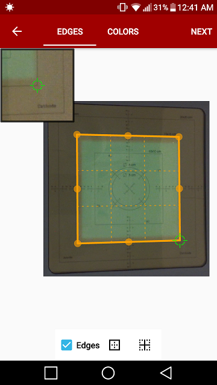
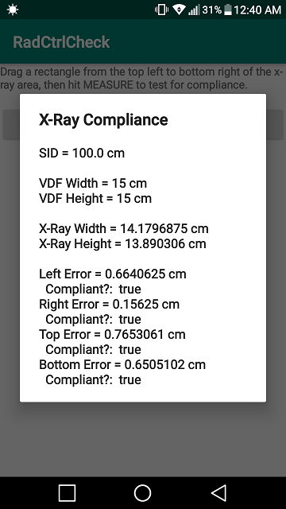

# RadCtrlCheck
Radiographic collimator compliance check for Android

## Synopsis
RadCtrlCheck is an app which allows the medical physicist to check for compliance of 105 CMR 120.406(A) of an x-ray system in less than a minute. The user takes a photo of a fluorescent film post irration, defines the expected border with a finger-drag, then defines the actual border with another finger-drag. The compliance is met if the actual and expected borders are within 5% of each other.

## Usage
1. Click "DROID SCAN LITE" in RadCtrlCheck to enter Droid Scan Lite app (not included)
2. Take picture of fluorescent film or import from media library
3. Drag selection border to boundaries of expected collimator dimensions (e.g. 15cm x 15cm)
4. Save converted image into media library and exit Droid Scan Lite
5. Click "IMPORT IMAGE" in RadCtrlCheck and select the converted image from media library
6. Drag a rectangle from top/bottom-left to bottom/top-right to define actual collimation boundaries
7. Click "MEASURE" to initiate compliance check calculations
